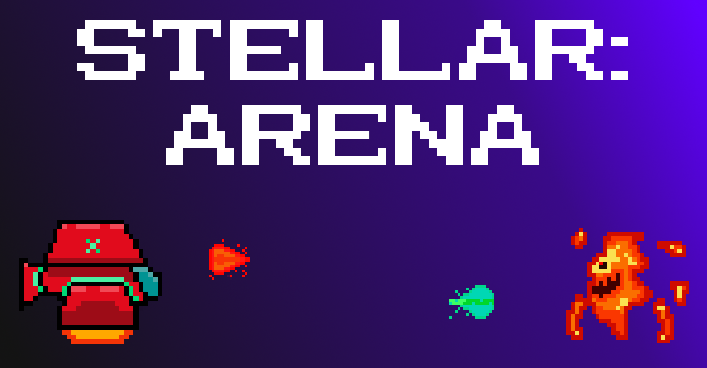
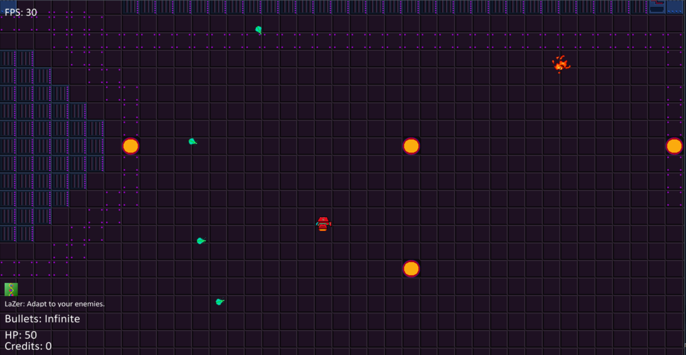

<!-- PROJECT LOGO -->
<br />
<p align="center">
  <a href="https://github.com/BramCetusAlt/Stellar-Arena/blob/master/Sprites/Logo.png">
    
  </a>
  
  <h3 align="center">Stellar: Arena </h3>
  
  <p align="center">
    An open source, indie, arcade, bullet hell game made in python for PyLam. 
    <br />
  <a href="https://github.com/BramCetusAlt/PyArcadeProject"><strong>Explore the docs</strong></a>
    <br />
    <br />
  <a href="https://github.com/BramCetusAlt/issues">Report Bug</a>
    ·
  <a href="https://github.com/BramCetusAlt/issues">Request Feature</a>
  </p>
</p>

## Table Of Contents

* [About the Project](#about-the-project)
  * [Built With](#built-with)
* [Getting Started](#getting-started)
  * [Prerequisites](#prerequisites)
  * [Installation](#installation)
* [Usage](#usage)
* [Roadmap](#roadmap)
* [Contributing](#contributing)
* [License](#license)
* [Contact](#contact)
* [Acknowledgements](#acknowledgements)

## About The Project

<a href="https://github.com/BramCetusAlt/Stellar-Arena/blob/master/Sprites/GameplayScreenshot.png">
    
  </a> <br>

In this retro bullet hell arcade game you take control of a small spacecraft in order to fight terrible aliens in an interstellar arena gladiator-style tournament! You are equipped with the cutting edge technology of the LaZer guns which fire a special bullet that can identify and analyze your enemies, so you can easily adapt to the fight and devastate them.

* Gameplay:

When you shoot your enemies with the green LaZer bullets, you adapt to their specific type and your next 15 bullets are now enhanced with special effect. There are three types of enemies and thus three types of enhanced bullets: Fire, Slime and Leech.

Fire bullets deal 10 damage over time to any enemy you hit. Slime bullets lower your enemies movement speed by 5 and Leech bullets will give you +5 Health Points. All enemies are immune to the effects of enchanced bullets of their own type. When you destroy an enemy you obtain 25 credits you can spend to buy power-ups. There are three power-ups in the game: Speed, Health and Effect. The Speed power-up costs 500 credits and will give you +3 movement speed, the Effect power-up costs 750 credits and will add a +5 bonus modifier to any of your enhanced bullets (e.g you fire bullets will now deal 10 + 5 damage over time instead of just 10) and the Health power-up costs 1000 and will give you +550 Health Points.

### Built With

* [The Python Arcade Library](https://pypi.org/project/arcade/)
* [Tiled Map Editor](https://www.mapeditor.org/)
* [Gimp](https://www.gimp.org/)
* [Audacity](https://www.audacityteam.org/)

## Getting Started

Simply download all the files and install the prerequisites. Make sure all of the files are in their correct folders and run the app.

### Prerequisites

* Python Arcade library (preferably version 2.1.6)
```sh
pip install arcade==2.1.6
```
* Tiled map editor
You will need this application if you want to create and import your own levels to the game or customize the existing ones.
You can download it from the official website: https://www.mapeditor.org/
Or clone it from Github: https://github.com/bjorn/tiled

### Installation

